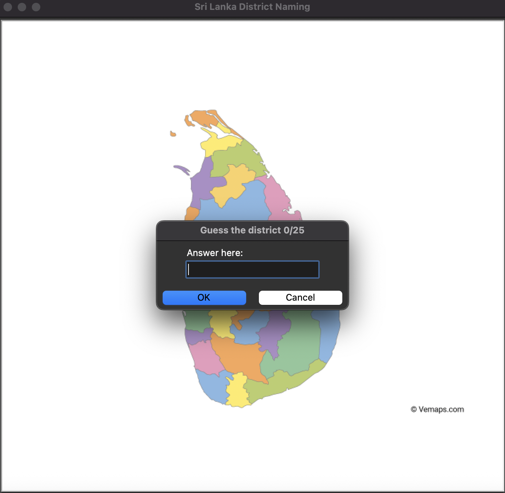
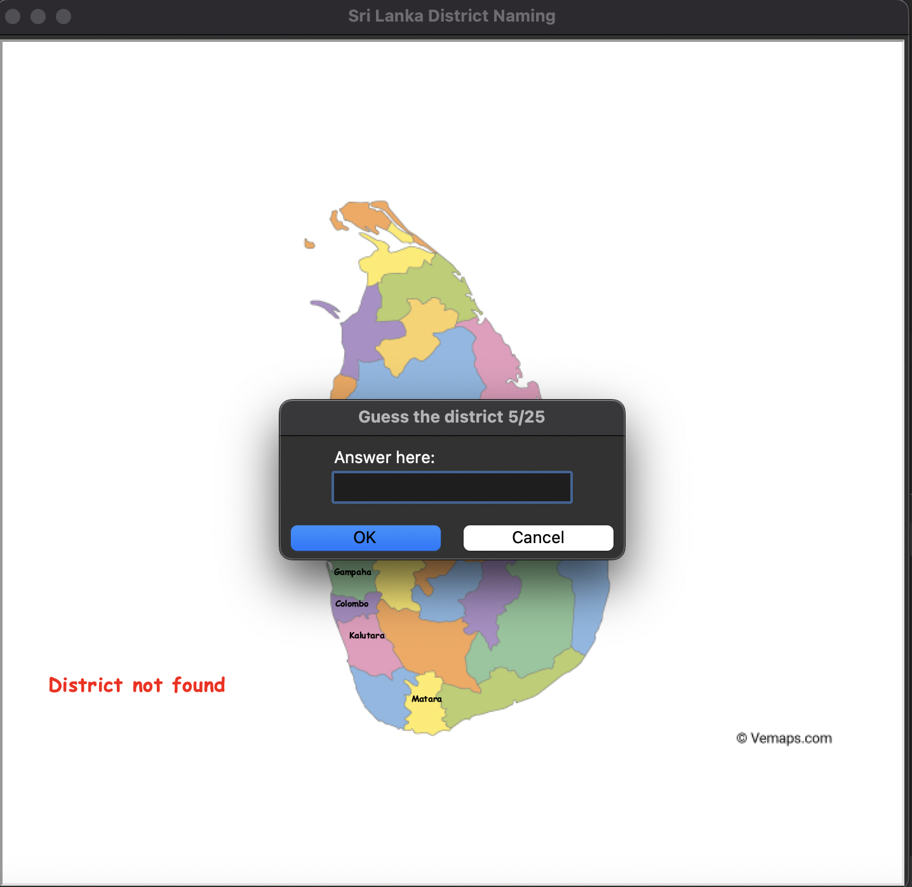
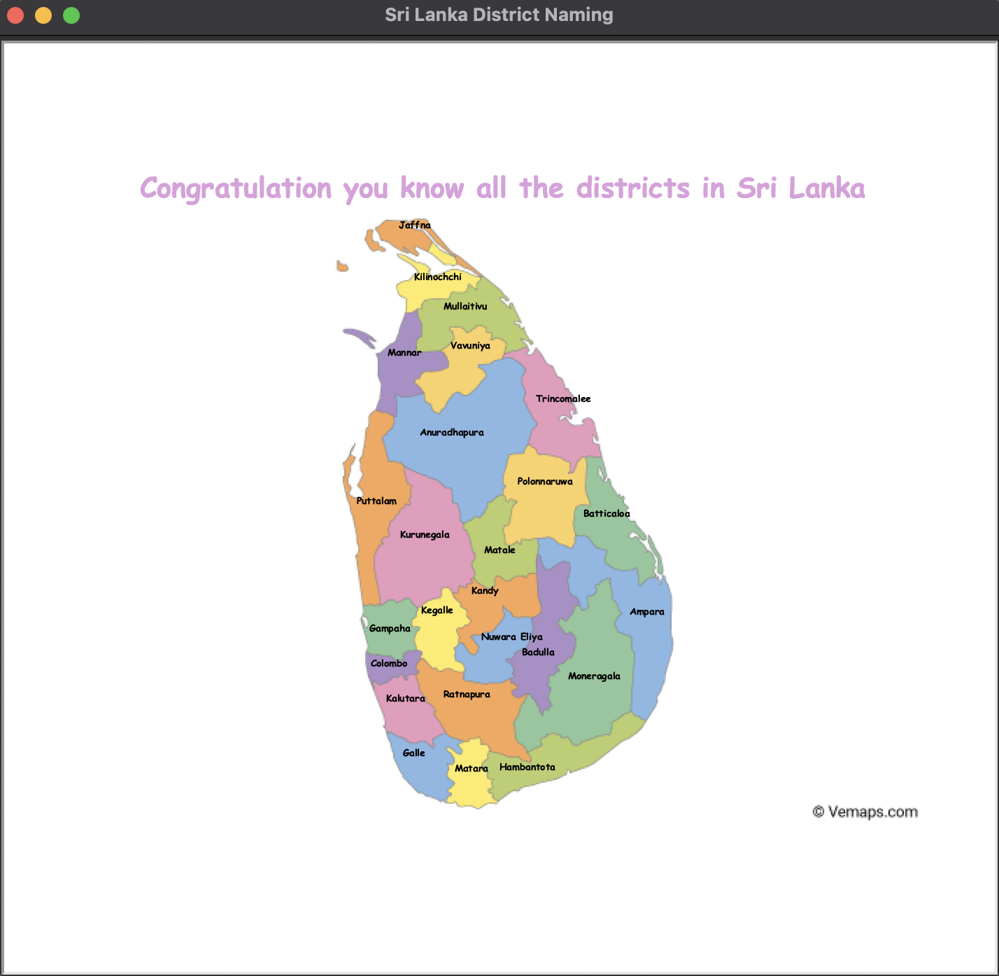

# Sri Lanka District Guessing Game

Welcome to the Sri Lanka District Guessing Game! This interactive game challenges you to name all the districts of Sri Lanka by clicking on the map. Test your knowledge and have fun exploring the geographical layout of Sri Lanka!

---

## How the Game Works

- The game displays a map of Sri Lanka.
- You are prompted to guess the name of a district.
- If your guess is correct, the district's name appears on the map at its location.
- If your guess is incorrect, a message indicates the district was not found.
- The game continues until all districts are correctly guessed.

---

## Folder Structure

```
First Git Repo/
│
├── README.md
├── NamedSriLankaDistricts/
│   ├── main.py
│   ├── sri_lanka_district.csv
│   ├── sri_lanka_map.gif
│   ├── 1.png
│   ├── 2.png
│   ├── 3.png
```

### Description of Files

- **main.py**  
  The main Python script that runs the game.

- **sri_lanka_district.csv**  
  Contains data about each district, including its name and coordinates for display.

- **sri_lanka_map.gif**  
  The map image of Sri Lanka used as the background for the game.

- **1.png**  
  Showcases the initial game screen with the map.

- **2.png**  
  Demonstrates what happens when a user guesses a district incorrectly.

- **3.png**  
  Celebrates the game completion when all districts are guessed correctly.

---

## Visuals

### 1. Starting Screen
*This image shows how the game appears when it first loads.*



### 2. Wrong Guess
*This image illustrates what happens when a user guesses incorrectly.*



### 3. Victory Screen
*This image displays the congratulatory message after successfully guessing all districts.*



---

## How to Run

1. Clone this repository or download the files.
2. Ensure you have Python installed (preferably Python 3.6+).
3. Install the required pandas library if not already installed:
   ```bash
   pip install pandas
   ```
4. Navigate to the `NamedSriLankaDistricts` folder in your terminal.
5. Run the game:
   ```bash
   python main.py
   ```

---

## Acknowledgements

📚 This project was inspired by core game mechanics outlined in a Python programming course. While the basic concept and requirements were provided by the course, I independently implemented the game to enhance my understanding of Python, turtle graphics, and data handling.

I truly enjoyed creating this project, and I hope you find it fun and educational! Feel free to modify and expand upon it.

---

## Contact

If you have any questions or suggestions, please reach out!

---

**Enjoy guessing the districts of Sri Lanka!**
